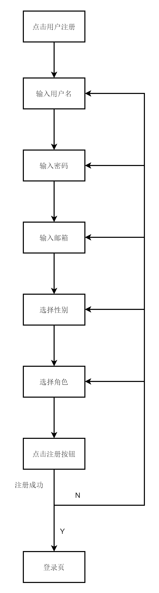

## 注册模块

### 角色

- 普通用户
- 一般管理员
- 超级管理员

#### 普通用户

##### 注册信息

1. 用户名
2. 密码
3. 邮箱
4. 性别
   _ps：一般管理员也可以审核_

#### 一般管理员

##### 注册信息

1. 用户名
2. 邮箱
3. 性别
4. 密码
   _ps：需要超级管理员审核_

#### 超级管理员

##### 注册信息

1. 用户名：root
2. 密码： admin

_ps：用户名和密码都是固定的，超级管理员只有一个_

### 注册流程图

