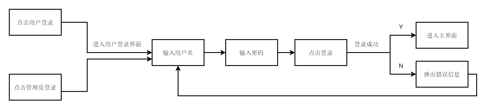

## 登录模块

### 用户角色

- 普通用户
- 图书管理员
- 超级管理员

#### 普通用户

使用用户名（自定义）、密码登录（自定义）。

#### 图书管理员

使用用户名（自定义）、密码登录（系统指定）。

#### 超级管理员

使用用户名（root）、密码登录（系统指定）。

### 登录系统

1. 用户登录系统
2. 管理员登陆系统

**_普通用户和管理员使用两个登陆系统，所有管理员使用同一个登陆系统_**

### 登录流程

